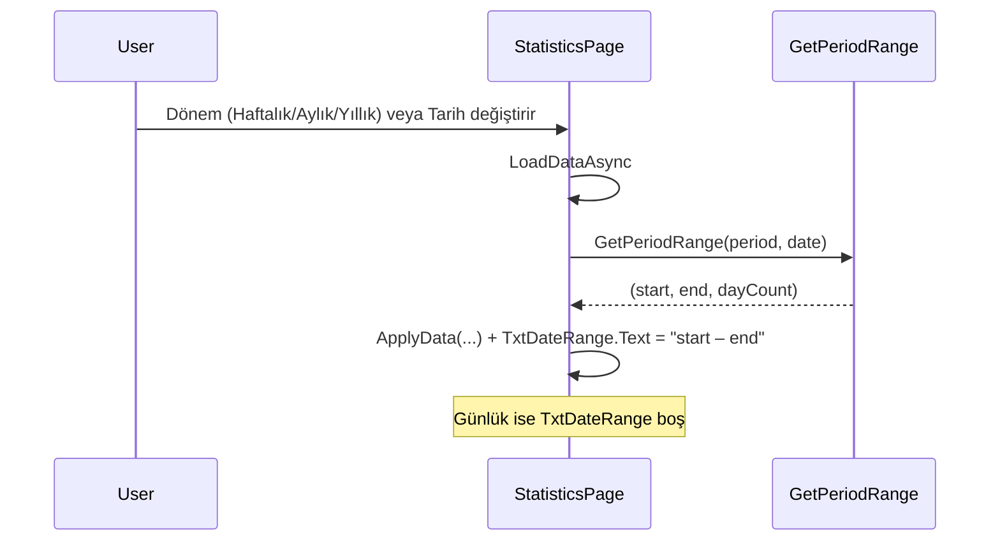

# İstatistikler sayfasında dönem aralığını gösterme

## Mevcut durum

- [StatisticsPage.xaml](src/Monity.App/Views/StatisticsPage.xaml): "Tarih:" etiketi + DatePicker + "Yenile" butonu var; aralık metni yok.
- [StatisticsPage.xaml.cs](src/Monity.App/Views/StatisticsPage.xaml.cs): `LoadDataAsync()` içinde `DurationAndPeriodHelper.GetPeriodRange(period, date)` ile `(start, end, dayCount)` zaten hesaplanıyor ve veri sorgularında kullanılıyor; bu aralık kullanıcıya yazdırılmıyor.
- [DurationAndPeriodHelper.cs](src/Monity.App/Helpers/DurationAndPeriodHelper.cs): Aralık mantığı hazır:
  - **Günlük:** tek gün (start = end)
  - **Haftalık:** o tarihin içinde olduğu ISO haftası (Pazartesi–Pazar)
  - **Aylık:** seçilen ayın 1’i – son günü
  - **Yıllık:** 1 Ocak – 31 Aralık

## Uygulama planı

### 1. XAML: Tarih aralığı metni için alan

**Dosya:** [StatisticsPage.xaml](src/Monity.App/Views/StatisticsPage.xaml)

- "Tarih seçimi" satırına (DatePicker ve Yenile’nin olduğu `StackPanel`) aralık metnini gösterecek bir `TextBlock` ekle.
- Öneri: DatePicker ile Yenile arasında veya Yenile’den sonra, `TextBlock` (örn. `x:Name="TxtDateRange"`) ekleyerek aralığı aynı satırda göstermek (örn. "10.02.2026 – 16.02.2026"). Günlük seçiliyken bu alan boş kalacak veya gizlenecek.
- Stil: `Foreground="{DynamicResource TextMutedBrush}"` veya `TextBrush`, mevcut "Tarih:" ile uyumlu font boyutu (örn. 13–14), uygun `Margin` ile çakışmayı önlemek.

### 2. Code-behind: Aralık metnini doldurma ve temizleme

**Dosya:** [StatisticsPage.xaml.cs](src/Monity.App/Views/StatisticsPage.xaml.cs)

- **LoadDataAsync:** Zaten `(start, end, dayCount) = GetPeriodRange(period, date)` alınıyor. `ApplyData` çağrıldığı `Dispatcher.InvokeAsync` lambda’sı içinde, aralık metnini de güncelle:
  - **Günlük:** `TxtDateRange.Text = ""` (veya `Visibility = Collapsed` kullanıyorsan gizle).
  - **Haftalık / Aylık / Yıllık:** `TxtDateRange.Text = $"{start:dd.MM.yyyy} – {end:dd.MM.yyyy}"` gibi bir format kullan. Tarih formatını `CultureInfo.CurrentCulture` ile vermek için `start.ToString("d", CultureInfo.CurrentCulture)` ve aynısını `end` için kullanmak yeterli; gerekirse "dd.MM.yyyy" gibi sabit bir format da seçilebilir (Türkçe kullanıcı için uygun).
- **ClearData:** Hata veya veri temizlenirken `TxtDateRange.Text = ""` (veya görünürlüğü sıfırla) ekle.

### 3. Özet akış

## Dosya özeti

| Ne                            | Nerede                                                                                                                |
| ----------------------------- | --------------------------------------------------------------------------------------------------------------------- |
| Yeni TextBlock (TxtDateRange) | [StatisticsPage.xaml](src/Monity.App/Views/StatisticsPage.xaml) — Tarih satırı                                        |
| Aralık metnini set etme       | [StatisticsPage.xaml.cs](src/Monity.App/Views/StatisticsPage.xaml.cs) — LoadDataAsync içindeki Dispatcher.InvokeAsync |
| Aralık temizleme              | [StatisticsPage.xaml.cs](src/Monity.App/Views/StatisticsPage.xaml.cs) — ClearData                                     |

Ek kütüphane veya helper gerekmez; `GetPeriodRange` ve mevcut `CultureInfo` kullanımı yeterli.