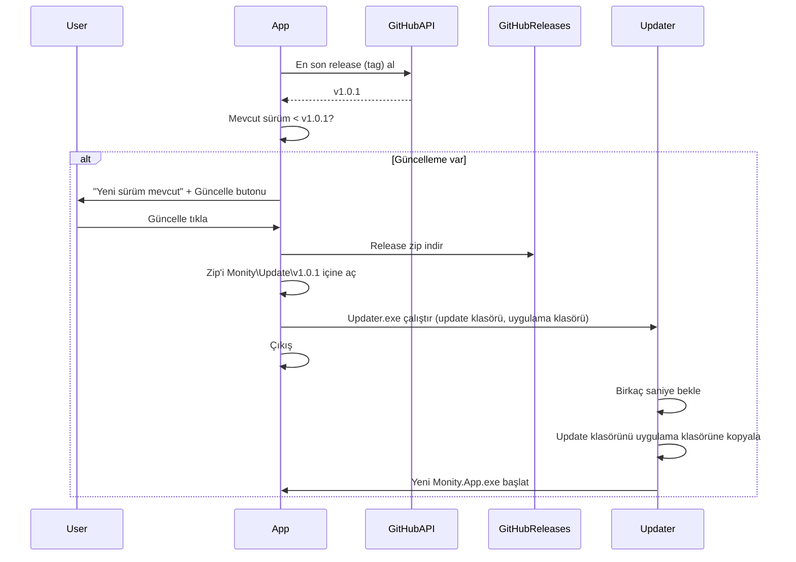

# Monity: Dağıtım ve Uygulama İçi Güncelleme Planı

## Hedef akış

---

## 1. Sürüm bilgisi

- [Monity.App.csproj](src/Monity.App/Monity.App.csproj) içine sabit sürüm ekle:
  - `Version` (örn. 1.0.0)
  - `AssemblyVersion` / `FileVersion` (pencere özellikleri / dosya sürümü)
  - `InformationalVersion` (güncelleme karşılaştırması için; GitHub tag ile aynı format: `1.0.0`)
- Uygulama açıldığında veya "Güncellemeleri kontrol et" tetiklenince bu sürüm okunacak (örn. `Assembly.GetExecutableAssembly().GetCustomAttribute<AssemblyInformationalVersionAttribute>()` veya tek bir `CurrentVersion` sabiti).

---

## 2. Güncelleme kontrolü (GitHub API)

- GitHub Releases "latest" endpoint: `GET https://api.github.com/repos/{owner}/{repo}/releases/latest`
- Yanıttan `tag_name` (örn. `v1.0.1`) alınacak; başındaki `v` kaldırılıp mevcut sürümle karşılaştırılacak (basit semver veya string karşılaştırma).
- Repo bilgisi (owner, repo adı) sabit veya ayarlanabilir bir yerde tutulacak (örn. bir `UpdateCheckConfig` sınıfı veya constants).
- İstek arka planda (async), UI donmadan yapılacak; ağ hatası / rate limit durumunda sessizce bırakılacak veya kullanıcıya "Kontrol edilemedi" mesajı gösterilecek.

---

## 3. UI: "Güncelleme var" ve tek tık güncelleme

- **Nerede gösterilecek:** Ana pencere header’ında (Ayarlar / Tray’e Küçült yanında) veya Ayarlar sayfasında.
- **Güncelleme yoksa:** Hiçbir şey veya sadece "Güncellemeleri kontrol et" (isteğe bağlı).
- **Güncelleme varsa:**
  - Kısa metin: örn. "Yeni sürüm mevcut (1.0.1)"
  - Buton: "Güncelle" (veya "İndir ve güncelle")
- Tıklanınca: indirme + kurulum akışı başlayacak (aşağıdaki adım 4). İndirme sırasında buton devre dışı veya "İndiriliyor..." gösterilebilir.

---

## 4. Güncellemeyi indirip üzerine kurma (tek tık)

**Sorun:** Çalışan exe’nin bulunduğu klasörü doğrudan güncellemek için, exe’nin kendisi kapatılmadan dosyaların üzerine yazılması gerekir; Windows’ta çalışan exe kilitli olduğu için üzerine yazılamaz.

**Çözüm:** Küçük bir **Updater** yardımcı programı:

- **Updater.exe:** Tek başına çalışan, hafif bir konsol uygulaması (ayrı proje veya tek exe).
- **Konumu:** `%LocalAppData%\Monity\Updater.exe` (sabit). Böylece güncelleme sırasında sadece *uygulama* klasörü (Monity.App.exe’nin olduğu yer) kopyalanır; çalışan Updater bu klasörde olmadığı için kilitlenme olmaz.
- **Görevi:** İki argüman alır: `kaynakKlasör` (açılmış güncelleme), `hedefKlasör` (mevcut uygulama yolu). Birkaç saniye bekler (ana uygulama kapansın), `kaynakKlasör` içeriğini `hedefKlasör`’e kopyalar, sonra `hedefKlasör\Monity.App.exe`’yi başlatıp kendisi çıkar.

**Ana uygulama tarafı:**

1. Güncelleme zip’ini indir (GitHub release’teki asset; örn. `Monity-1.0.1-win-x64.zip`).
2. Zip’i `%LocalAppData%\Monity\Update\{version}\` gibi bir klasöre aç (örn. `Update\1.0.1\`).
3. `Application.ExecutablePath` ile mevcut uygulama klasörünü belirle.
4. `%LocalAppData%\Monity\Updater.exe`’yi şu argümanlarla çalıştır: `(Update\1.0.1 klasörü, uygulama klasörü)`.
5. Ana uygulama hemen kapanır (örn. `Application.Current.Shutdown()`).

**İlk kurulumda Updater:** Uygulama ilk çalıştığında (veya her çalıştırmada kontrol ederek) `%LocalAppData%\Monity\Updater.exe` yoksa, exe’nin yanındaki `Updater.exe`’yi (release zip’inde gelecek) bu yola kopyalar. Böylece ilk dağıtımda tek zip yeterli olur.

---

## 5. Proje yapısı ve build

- **Monity.Updater:** Yeni bir konsol projesi (örn. `src/Monity.Updater/`).
  - Girdi: 2 argüman (kaynak ve hedef klasör).
  - Kısa bekleme → tüm dosyaları kopyala (hedefteki Monity.App.exe üzerine yazılır) → `Process.Start(hedef\Monity.App.exe)` → çıkış.
  - Mümkünse tek exe, az bağımlılık (self-contained tek dosya tercih edilebilir).
- **Monity.App:** Güncelleme mantığı için bir servis veya sınıf (örn. `UpdateService` veya `UpdateChecker`):
  - GitHub API çağrısı, sürüm karşılaştırma, zip indirme, açma, Updater’ı başlatma, gerekirse Updater’ı `%LocalAppData%\Monity\`’e kopyalama.
- **Release zip içeriği (GitHub Releases’e yüklenecek):**
  - `dotnet publish` çıktısı (Monity.App + tüm DLL’ler) **artı** `Updater.exe` (Monity.Updater publish’inden).
  - Zip adı: tutarlı bir format (örn. `Monity-{version}-win-x64.zip`) ki GitHub API’den asset URL’i kolay bulunabilsin (örn. ilk asset veya bu isimle eşleşen asset).

---

## 6. Dağıtım (diğer kullanıcıların indirmesi)

- GitHub repo’da **Releases** kullanımı:
  - Her yeni sürümde bir release oluşturulur (tag: `v1.0.0`, `v1.0.1` …).
  - Release’e `Monity-1.0.0-win-x64.zip` (ve benzeri) eklenir.
- README’de "İndir" bölümü: "En son sürüm: [Releases](https://github.com/.../releases) sayfasından Monity-x.x.x-win-x64.zip indirilip bir klasöre açılır; Monity.App.exe çalıştırılır" şeklinde kısa talimat.
- Gereksinim: .NET 8 (self-contained publish yapılırsa kullanıcının .NET yüklemesi gerekmez; önerilir).

---

## 7. Özet yapılacaklar

| Adım            | İçerik                                                                                                         |
| --------------- | -------------------------------------------------------------------------------------------------------------- |
| Sürüm           | Csproj’da Version/InformationalVersion; uygulama içinde okuma                                                  |
| GitHub API      | Latest release + tag_name; repo/owner sabit veya yapılandırma                                                  |
| Updater projesi | Küçük konsol uygulaması: bekle → kopyala → Monity.App.exe başlat                                               |
| UpdateService   | API çağrısı, indirme, zip açma, Updater’ı LocalAppData’ya kopyalama (yoksa), Updater’ı argümanlarla çalıştırma |
| UI              | Header veya Ayarlar’da "Yeni sürüm (x.y.z)" + "Güncelle" butonu                                                |
| Release zip     | Publish çıktısı + Updater.exe; isim formatı tutarlı                                                            |
| README          | İndirme ve kurulum kısa açıklaması                                                                             |

Bu plan ile hem "diğer kullanıcılar indirip kullanır" hem de "güncelleme yaptıkça uygulama içinde yeni sürüm / güncelleme mevcut mesajı ve tek tıkla üzerine alma" hedefleri karşılanır.