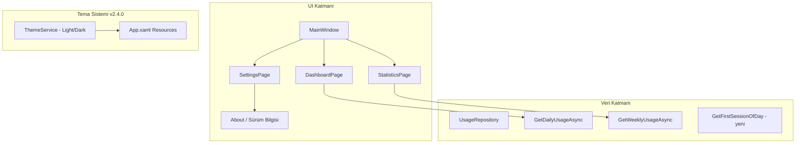

# Monity Özellik Yol Haritası Planı

## Genel Mimari Özet

---

## 1. İstatistikler Sayfasına Grafikler (v2.3.0)

**Mevcut durum:** [StatisticsPage.xaml](src/Monity.App/Views/StatisticsPage.xaml) sadece tablo (Toplam süre, Günde ortalama, Kullanım kaydı kartları + uygulama listesi) gösteriyor.

**Hedef:** Dashboard'daki gibi grafikler eklemek.

**Yapılacaklar:**

- **Saatlik kullanım grafiği (Bar chart):** Seçilen dönemdeki günlük ortalama veya tek gün için saatlik dağılım. [DashboardPage.xaml.cs](src/Monity.App/Views/DashboardPage.xaml.cs) içindeki `HourlyChart` + `SetupHourlyChartAxes` mantığını tekrar kullan.
- **Uygulama dağılım grafiği (Pie/Donut chart):** En çok kullanılan uygulamaların yüzde dağılımı. LiveCharts2 `PieSeries` kullanılabilir.
- **Haftalık/Aylık karşılaştırma (Bar chart):** Dönem günlük değilse, günlere göre toplam süre çubuk grafiği (örn. haftalık: 7 gün, aylık: ~30 gün).

**Veri:** `UsageRepository.GetHourlyUsageAsync` (tarih bazlı) zaten var. Haftalık/aylık için `GetRangeTotalAsync` veya yeni `GetDailyTotalsInRangeAsync(DateTime start, DateTime end)` gibi bir metod eklenebilir.

**Sürüm:** 2.3.0

---

## 2. Dark Mode (v2.4.0)

**Mevcut durum:** [App.xaml](src/Monity.App/App.xaml) sabit renkler: `BackgroundBrush`, `CardBrush`, `TextBrush` vb.

**Hedef:** Kullanıcının Light/Dark tema seçebilmesi.

**Yapılacaklar:**

- **Tema kaynağı:** `App.xaml` içindeki `ResourceDictionary` yerine dinamik tema yüklemesi. İki ayrı `ResourceDictionary` (Light.xaml, Dark.xaml) veya `ThemeService` ile runtime'da brush'ları değiştirme.
- **Ayarlarda tema seçici:** [SettingsPage.xaml](src/Monity.App/Views/SettingsPage.xaml) içine "Tema: Açık / Koyu / Sistem" (Radio veya ComboBox).
- **Kalıcılık:** `app_settings` tablosuna `theme` (light/dark/system) kaydı.
- **Sistem teması:** `Microsoft.Win32.SystemEvents.UserPreferenceChanged` veya WPF `RequestedTheme` benzeri yaklaşımla Windows tema değişimini dinleme (isteğe bağlı).
- **Renk paleti (Dark):** Örn. Background: #1E293B, Card: #334155, Text: #F8FAFC, Border: #475569, Primary: #3B82F6.

**Etkilenen dosyalar:** App.xaml, MainWindow.xaml, tüm Page'ler (StaticResource kullandıkları için tema değişince otomatik güncellenir).

**Sürüm:** 2.4.0

---

## 3. Takip Hariç Tutulan Uygulamaların Dashboard ve İstatistiklerde Gizlenmesi (v2.5.0)

**Mevcut durum:** `ignored_processes` ayarı sadece **gelecekteki** takibi durduruyor ([TrackingEngine](src/Monity.Infrastructure/Tracking/TrackingEngine.cs)). `GetDailyUsageAsync` ve `GetWeeklyUsageAsync` hariç tutulan uygulamaları filtrelemiyor; Dashboard ve İstatistikler'de hâlâ görünüyorlar.

**Hedef:** Ayarlarda "Kaydet" sonrası Dashboard ve İstatistikler listelerinde bu uygulamaların görünmemesi.

**Yapılacaklar:**

- **Repository:** `GetDailyUsageAsync` ve `GetWeeklyUsageAsync` metodlarına `IReadOnlyList<string>? excludedProcessNames = null` parametresi ekle. `excludedProcessNames` verilirse SQL'e `AND a.process_name NOT IN (...)` filtresi ekle.
- **Görünüm tarafı:** [DashboardPage.xaml.cs](src/Monity.App/Views/DashboardPage.xaml.cs) ve [StatisticsPage.xaml.cs](src/Monity.App/Views/StatisticsPage.xaml.cs) içinde veri yüklemeden önce `GetSettingAsync("ignored_processes")` ile hariç listesini al, repository çağrısına geç.
- **Toplam süre tutarlılığı:** `GetDailyTotalAsync` ve `GetRangeTotalAsync` şu an `daily_summary` / `usage_sessions` üzerinden toplamı hesaplıyor. Hariç tutulan uygulamaların süreleri de dahil. Tutarlılık için bu metodlara da aynı `excludedProcessNames` filtresi eklenmeli; aksi halde toplam süre ile liste toplamı uyuşmaz.

**Sürüm:** 2.5.0

---

## 4. Günlük Bilgisayar Başlangıç Saati (v2.6.0)

**Mevcut durum:** Dashboard üstte "Bugün Toplam", "Kullanım kaydı", "Şu an aktif" kartları var; başlangıç saati yok.

**Hedef:** Seçilen gün için "bilgisayara başlangıç saati" veya "ilk kullanım saati" bilgisini üstte göstermek.

**Yapılacaklar:**

- **Veri kaynağı seçenekleri:**
  - **A)** `usage_sessions` tablosunda seçilen günün en erken `started_at` değeri → "İlk kullanım: 09:15" gibi.
  - **B)** Windows son açılış zamanı (GetTickCount64 veya WMI) → daha doğru "açılış" saati.
- **Öneri:** A seçeneği daha basit ve mevcut veriyle uyumlu. Yeni repository metodu: `GetFirstSessionStartedAtAsync(string date)` → `DateTime?`.
- **UI:** [DashboardPage.xaml](src/Monity.App/Views/DashboardPage.xaml) özet kartlarının üstüne veya yanına: "Bugün başlangıç: 08:42" veya "İlk kullanım: 09:15" metni.
- **Boş durum:** O gün hiç oturum yoksa "—" veya gizle.

**Sürüm:** 2.6.0

---

## 5. Geliştirici Bilgisi ve Sosyal Medya (v2.7.0)

**Hedef:** Geliştirici adı, soyadı ve sosyal medya linklerinin gösterilmesi.

**Yapılacaklar:**

- **Konum:** Ayarlar sayfasının altında veya ayrı "Hakkında" bölümü.
- **İçerik:** Geliştirici adı soyadı, GitHub/Twitter/LinkedIn vb. linkler (Hyperlink veya buton).
- **Veri:** Sabit string veya `AboutConfig.cs` benzeri sınıf (isim, linkler). Kullanıcı kendi bilgilerini buraya girecek.
- **Örnek XAML:** Ayarlar sonunda `StackPanel` ile "Geliştirici: [Ad Soyad]" ve `Hyperlink`'ler.

**Not:** Gerçek isim ve sosyal medya linkleri kullanıcı tarafından doldurulacak.

**Sürüm:** 2.7.0

---

## 6. Sürüm Bilgisi (v2.7.0)

**Hedef:** Uygulama sürümünün kullanıcıya gösterilmesi.

**Mevcut durum:** [AppVersion.cs](src/Monity.App/AppVersion.cs) zaten `AppVersion.Current` ile sürümü sağlıyor; UI'da kullanılmıyor.

**Yapılacaklar:**

- **Konum:** Ayarlar sayfasında veya "Hakkında" bölümünde.
- **Metin:** "Monity v2.2.2" gibi. `AppVersion.Current` kullanılacak.
- **Ek (isteğe bağlı):** "Güncellemeler" linki → [UpdateCheckConfig.ReleasesPageUrl](src/Monity.App/UpdateCheckConfig.cs).

**Sürüm:** 2.7.0 (Geliştirici bilgisi ile birlikte)

---

## Sürüm Özeti

| Sürüm     | Özellik                                                                   |
| --------- | ------------------------------------------------------------------------- |
| **2.3.0** | İstatistikler sayfasına grafikler (saatlik bar, pie, dönem karşılaştırma) |
| **2.4.0** | Dark mode (Light/Dark tema, ayarlardan seçim)                             |
| **2.5.0** | Dashboard ve İstatistikler'de hariç tutulan uygulamaların filtrelenmesi   |
| **2.6.0** | Dashboard'da günlük bilgisayar/ilk kullanım başlangıç saati               |
| **2.7.0** | Geliştirici bilgisi, sosyal medya linkleri, sürüm bilgisi (Hakkında)      |

---

## Uygulama Sırası Önerisi

1. **v2.5.0** – Hariç tutulan uygulamaların filtrelenmesi (küçük, mantıksal tutarlılık)
2. **v2.6.0** – Başlangıç saati (basit veri + UI)
3. **v2.7.0** – Geliştirici + sürüm bilgisi (tek Hakkında bloğu)
4. **v2.4.0** – Dark mode (tema altyapısı)
5. **v2.3.0** – İstatistikler grafikleri (en çok iş gerektiren)

