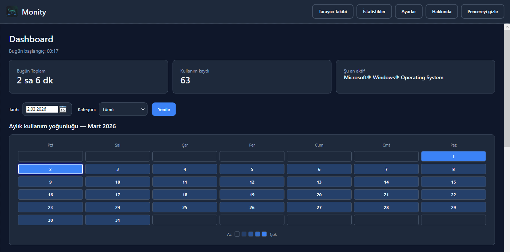
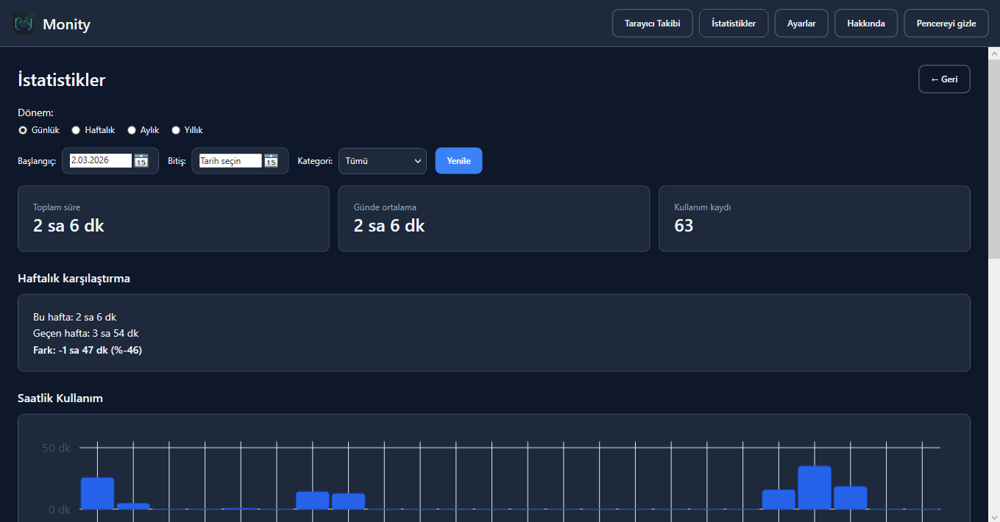
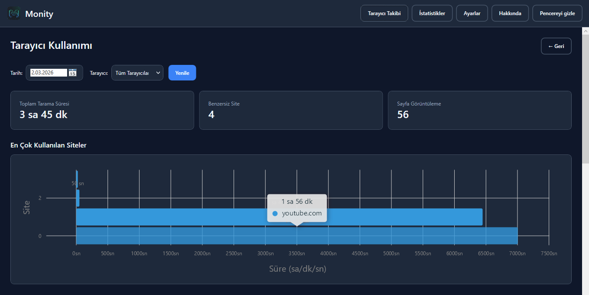
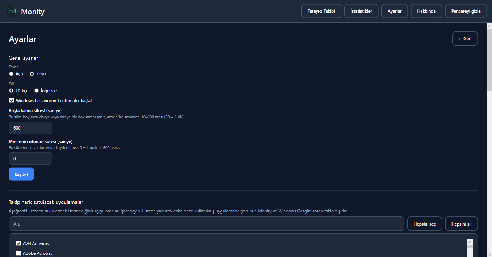
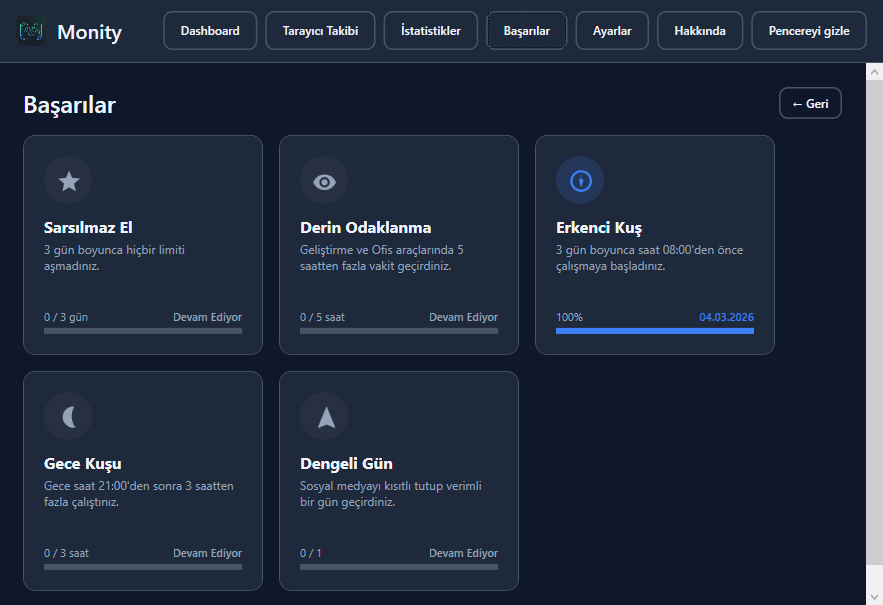
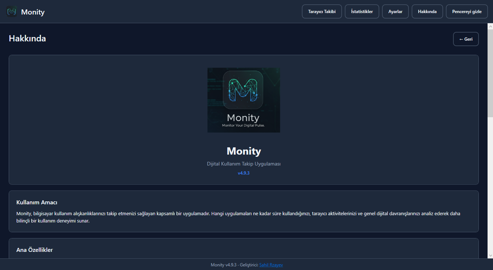

# Monity

[Turkish](README.md) | [English](README.en.md)

A WPF application that tracks **application usage time** on Windows desktop. It shows how much time you spend on which application with a daily summary, hourly chart, and application list.

## Screenshots


*Main dashboard - daily usage summary, heat map, and application list*


*Statistics page - periodic analysis and charts*


*Browser tracking - site-based usage analysis*


*Settings page - theme, language, and other preferences*


*Achievements page - earned rewards and progress*


*About page - application info and developer contact*

---

## Features

### Tracking
- **Foreground application tracking:** Tracks the duration of the window in focus (Chrome, Cursor, games, etc.).
- **UWP support:** Resolves real UWP processes (Calculator, Photos, etc.) via ApplicationFrameHost.
- **Browser tracking:** Site-based usage tracking in browsers like Chrome, Firefox, Edge, Opera GX.
- **Idle tracking:** Time without keyboard/mouse activity is not counted (adjustable threshold, 10–600 seconds).
- **Power events:** Sessions are written to the database on Sleep/Wake.
- **Batch writing:** High-performance SQLite writing with a session buffer (20 records or 5 minutes).
- **Single instance control:** Only one instance of the application can run at a time.
- **Smart Suggestion System:** Analyzes usage habits to provide insights on productive hours, usage trends, and unusual activities.
- **Daily Report Notification:** Sends a notification every evening at a set time with the day's total active time and most used application.
- **Goal System:** Set daily or weekly usage limits (e.g., "Max 3 hours of Social media per day"). Easy goal entry using natural language processing.
- **Achievement System:** Earn rewards for healthy digital habits and focus durations (e.g., "Steady Hand", "Deep Focus").

### Interface
- **Dashboard:** For the selected day: **start of today** (first usage time or "—"), total duration, number of usage records, "currently active" application; **date** and **category** filters, refresh button. Progress bars for active goals can be tracked on the main screen.
- **Monthly usage intensity (heat map):** Calendar grid (Mon–Sun) for the selected month; each cell shows day number and intensity color (theme compatible), Less–More legend at the bottom.
- **Hourly chart:** Usage distribution throughout the day (LiveCharts2 bar chart).
- **Application list:** Daily usage duration and percentage table; filtering with search box.
- **Statistics:** A separate page accessed from the main menu:
  - **Period selector:** Daily, weekly, monthly, or yearly.
  - **Date and category selection:** Total duration, daily average, and usage count based on the selected period.
  - **Weekly comparison:** This week / last week total duration and difference (absolute + percentage).
  - **Time distribution chart:** Hourly bar chart in daily mode; daily total bar chart in weekly/monthly/yearly mode.
  - **Application distribution chart:** Pie chart of most used applications; slice and tooltip values with 2 decimal places.
  - **Application usage table:** Total, average, and percentage columns; filtering with search box. Excluded applications are not shown in the list or totals.
  - **Export:** Export statistics to CSV (UTF-8 BOM, Excel-compatible) for the selected period and category; includes summary, application list, and daily breakdown.
  - **Back to Dashboard:** Return button next to the page title and at the end of the page.
- **Pomodoro (Focus Timer):** Page accessible from the main menu; configurable work and break durations (default 25/5 min), countdown, start/pause/stop, and tray notification when a period ends.
- **Achievements:** A dedicated page accessed from the main menu to track earned rewards and progress.
- **Share:** Generate a usage summary card for today, this week, or this month. The card shows period label, date range, total duration, trend vs. previous period (percentage), daily average, most used application, peak productive hours (if available), a single insight highlight, and goal status (if set). The right panel lists category distribution (top 3 categories), top 3 applications (with mini bar chart), and highlights. The layout is clean and focused; the image can be copied to the clipboard or shared externally.
- **Browser Tracking:** A separate page accessed from the main menu:
  - **Hourly browser activity:** Hourly usage chart for the selected day.
  - **Browser usage:** Filtering by browser and total duration display.
  - **Most visited sites:** Site-based usage duration and percentage chart.
  - **Site usage list:** Detailed table view, search and sort features.
- **Screenshot capture:** Use the camera icon in the top header to capture a screenshot of the whole app. Supports **visible area** or **full page (scrollable content)** modes with preview, PNG save, and copy-to-clipboard.
- **Settings:**
  - **Theme:** Light or Dark; applied immediately upon selection, preference is saved.
  - **Language:** Turkish or English; interface texts and category lists change based on the selected language.
  - **Auto-start at Windows startup:** Optional (Registry Run or task scheduler).
  - **Idle time** (seconds), between 10–600.
  - **Minimum session duration** (seconds): 0 = off, between 1–600; sessions shorter than this are not recorded.
  - **Record window title:** When on, which file or page you work on (window title) is used in reports; can be turned off for privacy.
  - **Focus mode:** When on, a tray notification is shown when switching to any of the selected apps in the list.
  - **Applications to exclude from tracking:** Lists both previously used (in DB) and **installed programs** (from Windows Uninstall records); filtering with search box. Monity and Windows Explorer are excluded by default.
  - **Daily time limits:** Minute limit per application (1–1440); tray notification when limit is exceeded. Optional **"Close application when limit is exceeded"** option.
  - **Application categories:** Categories can be assigned to each application (Browser, Development, Social, Entertainment, Office, Other, Uncategorized); filtering by category in Dashboard and Statistics.
  - **Daily Report Notification:** Daily summary notification at a set time; secure time selection with dropdown lists (ComboBox).
  - **Goal Management:** Add and delete usage goals. Quick entry with sentences like "Max 2 hours of Social daily", "Min 10 hours of Development weekly".
  - **Data management:** Delete data older than 30 / 90 / 365 days or delete all data (with confirmation dialog).
  - **About:** A separate page accessed from the main menu; app logo, description, features, developer info, contact links (Email, GitHub, LinkedIn), and version history.
- **Header:** Logo and app name on the left, navigation buttons on the right in a two-column layout so they do not overlap in small window mode. Buttons use compact padding to save space.
- **Footer:** Version info and developer link in the main window.
- **Tray:** Hide window, double-click to reopen; notification texts change based on selected language.

### Data
- **SQLite:** Database located at `%LocalAppData%\Monity\monity.db`.
- **Application matching:** Same exe in different user paths (e.g., `...\User\...` and `...\Username\...`) are merged as a single application.

---

## Requirements

- **Windows** 10 or 11
- **.NET 8** (or installation with the self-contained zip below; no need to install .NET separately)

---

## Download and Setup

1. Go to the [Releases](https://github.com/rzayevsahil/Monity/releases) page.
2. Download **Monity-Setup-x.x.x.exe** (recommended) or **Monity-x.x.x-win-x64.zip** (portable) from the latest version.
3. **Setup exe:** Run the installation wizard; desktop shortcut and Start menu entry are created automatically. Default installation path: `%LocalAppData%\Monity`. Can be uninstalled from Programs and Features.
4. **Zip:** Extract to a folder and run **Monity.App.exe**. In-app updates use this zip.

**Update:** The application checks the **latest release** (`releases/latest`) on GitHub every time it starts. If the version number (tag, e.g., v2.0.0) is higher than the installed version, "New version available (x.x.x)" and an **Update** button appear; the zip is downloaded and installed with one click.

**If update is not visible:** Check may sometimes fail due to network errors or GitHub API limit (60 requests per hour). You can manually download and install the latest version from the [Releases](https://github.com/rzayevsahil/Monity/releases) page. Error details are logged with "Update check failed" in `%LocalAppData%\Monity\Logs\monity-*.log`.

---

## Build and Run

```bash
# After cloning the solution
cd monity

# Build
dotnet build Monity.sln

# Run
dotnet run --project src/Monity.App/Monity.App.csproj
```

---

## Project Structure

```
monity/
├── Monity.sln
├── README.md
└── src/
    ├── Monity.Domain/           # Entities: UsageSession, ForegroundProcessInfo, etc.
    ├── Monity.Infrastructure/
    │   ├── WinApi/              # P/Invoke: GetForegroundWindow, GetGUIThreadInfo, GetLastInputInfo
    │   ├── Tracking/            # TrackingEngine, SessionBuffer, UsageTrackingService
    │   ├── Persistence/         # SQLite (Dapper), DatabaseMigrator, UsageRepository
    │   ├── InstalledApps/       # InstalledAppsProvider (Uninstall registry)
    │   └── AppDisplayNameResolver
    ├── Monity.App/
    │   ├── Services/            # UpdateService, ThemeService, LanguageService, StartupService, DailyLimitCheckService
    │   ├── Resources/           # Strings.tr.xaml, Strings.en.xaml (i18n)
    │   ├── Themes/              # Light.xaml, Dark.xaml (ResourceDictionary)
    │   ├── Views/               # DashboardPage, StatisticsPage, SettingsPage, BrowserTrackingPage, AchievementsPage, ShareCard, AboutPage
    │   ├── Helpers/             # DurationAndPeriodHelper, Strings (resource lookup)
    │   ├── Power/               # PowerEventHandler (WM_POWERBROADCAST)
    │   └── App.xaml(.cs)
    └── Monity.Updater/          # Update helper (one-click update)
```

---

## Technology

| Component      | Technology |
|----------------|------------|
| UI             | WPF (.NET 8) |
| Database       | SQLite + Dapper |
| Graphics       | LiveCharts2 (SkiaSharp) |
| Logging        | Serilog (file) |
| DI             | Microsoft.Extensions.DependencyInjection |

---

## Database Schema

| Table             | Description |
|-------------------|-------------|
| `apps`            | Application meta (process_name, exe_path, display_name, category_id). Single record for same exe in different paths. |
| `app_categories`  | Category names (id, name). For application categories. |
| `usage_sessions`  | Raw sessions: app_id, started_at, ended_at, duration_seconds, is_idle, day_date. |
| `daily_summary`   | Daily summary (app_id, date, total_seconds, session_count, idle_seconds). |
| `browser_sessions`| Browser sessions: browser_name, domain, started_at, ended_at, duration_seconds, day_date. |
| `browser_daily_summary` | Daily browser summary: domain, date, total_seconds, session_count. |
| `app_settings`    | Settings: idle_threshold_seconds, min_session_seconds, ignored_processes, theme (light/dark), language (tr/en), daily_limits (JSON), limit_exceeded_action (notify/close_app), start_with_windows. |
| `achievements`    | Achievement definitions: key, type, goal_value. |
| `user_achievements` | User progress: achievement_id, current_value, is_unlocked, unlocked_at. |

Data is kept in local time; dashboard queries are performed via `daily_summary`.

---

## Settings (Summary)

| Setting | Description |
|---------|-------------|
| **Theme** | Light or Dark. Applied immediately on startup or upon Save in Settings. |
| **Language** | Turkish or English. Interface and category lists change based on the selected language. |
| **Auto-start at Windows startup** | When on, the app starts with Windows. |
| **Idle time** | 10–600 seconds. If no input for this duration, time is not counted. |
| **Minimum session duration** | 0 = off, 1–600 seconds. Sessions shorter than this are not recorded. |
| **Record window title** | When on, window title is used in reports; can be turned off for privacy. |
| **Focus mode** | When on, tray notification when switching to apps in the list. |
| **Applications to exclude from tracking** | Applications marked in the list are not shown in Dashboard or Statistics. List: apps used in DB + Windows installed programs. |
| **Daily time limits** | Minute limit per application; tray notification on excess. Optional "Close application when limit is exceeded". |
| **Application categories** | Categories assigned to apps; category filter used in Dashboard and Statistics. |
| **Smart Suggestion System** | Analyzes usage habits to provide insights; can be enabled/disabled in Settings. |
| **Daily Report Notification** | Daily summary notification at a set time; secure time selection via ComboBox. |
| **Data management** | Delete data older than 30 / 90 / 365 days or all data (with confirmation). |

---

## License

The license determined by the project owner applies.
